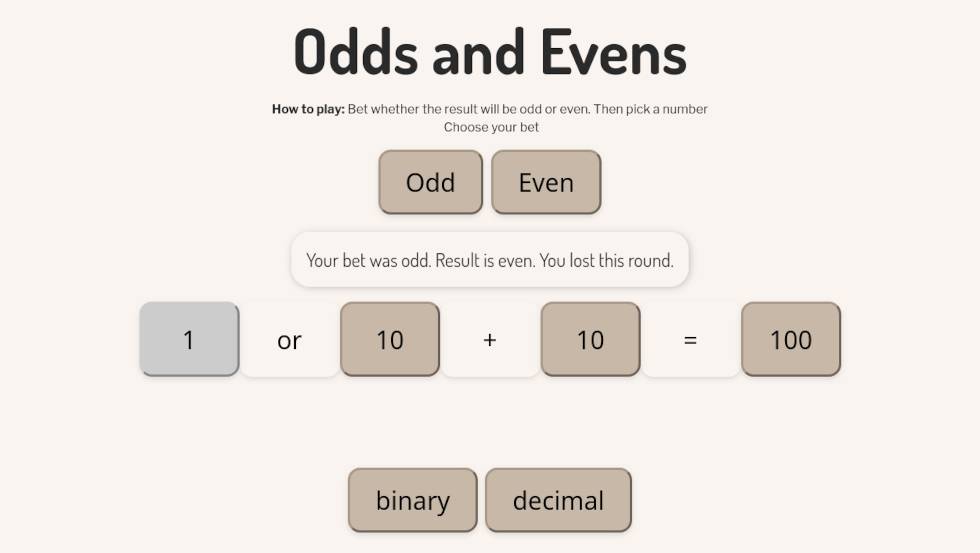
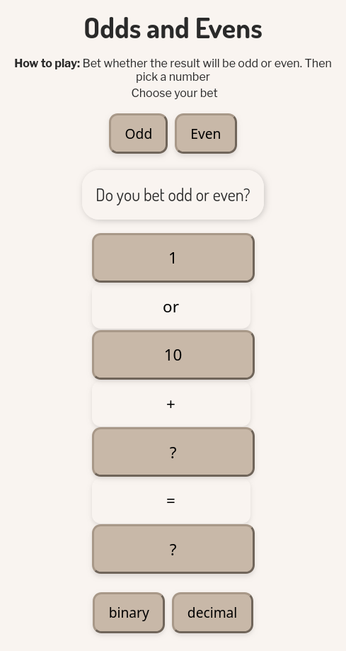
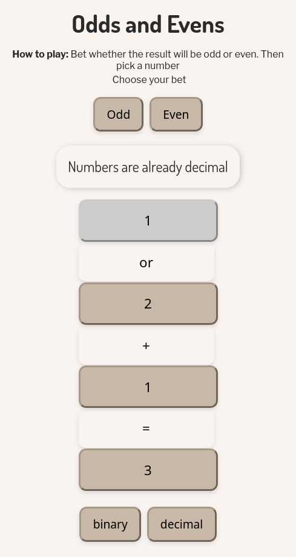

# Odd/Even Game (JavaScript, DOM Manipulation)

Small web app/browser game

## Screenshots:

A **minimalist number-guessing game** where players bet on odd/even outcomes and pick numbers. Features:

- **Binary/decimal toggle** for all displayed numbers (dynamic base conversion).
- **Interactive UI** with real-time feedback and button states.
- **Asynchronous flow** (simulated "computer thinking" with `setTimeout`).
- **Clean, modular event handling** for bets, picks, and results.

**Built to practice:**

- DOM manipulation (no frameworks)
- State management with vanilla JS
- User feedback and edge-case handling

Thank you for visiting !
